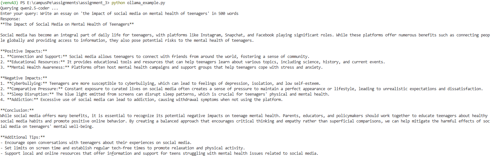
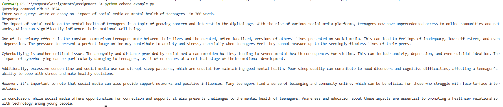
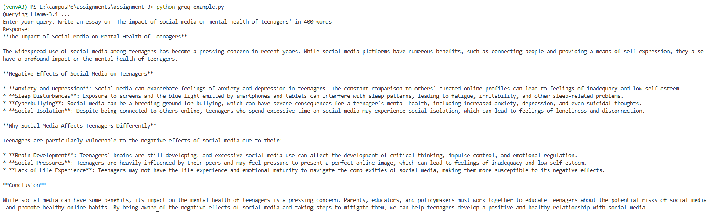
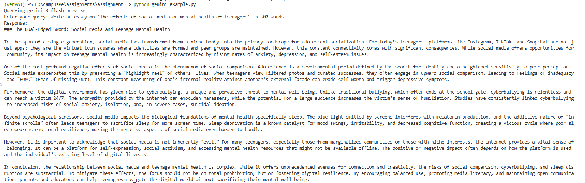
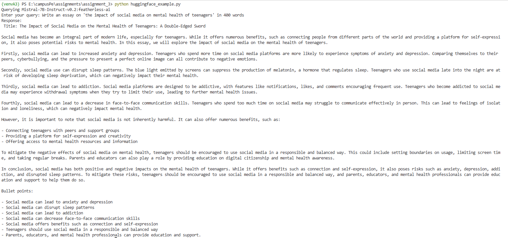

## LLM Prompting Examples

This folder contains **5 small Python programs** that send a prompt to different LLM providers and print the model response.

- **Local model (no API key)**: Ollama (`ollama_example.py`)
- **Cloud/API models (API key required)**:
  - Cohere (`cohere_example.py`)
  - Groq (`groq_example.py`)
  - Gemini / Google GenAI (`gemini_example.py`)
  - Hugging Face Inference (`huggingface_example.py`)

All scripts use a **system prompt** to enforce consistent style/constraints.

---

## Project structure

- **`ollama_example.py`**: Calls a local Ollama model (`qwen2.5-coder:3b`)
- **`cohere_example.py`**: Calls Cohere Chat (`command-r7b-12-2024`)
- **`groq_example.py`**: Calls Groq Chat Completions (`llama-3.1-8b-instant`)
- **`gemini_example.py`**: Calls Google GenAI (`gemini-3-flash-preview`)
- **`huggingface_example.py`**: Calls Hugging Face chat completions (`mistralai/Mistral-7B-Instruct-v0.2:featherless-ai`)
- **`requirements.txt`**: Python dependencies

---

## Setup (common for all scripts)

- **Python**: Install Python 3.10+ (recommended).
- **Create and activate a virtual environment (Windows PowerShell)**:

```bash
python -m venv .venv
.\.venv\Scripts\Activate.ps1
```

- **Install dependencies**:

```bash
pip install -r requirements.txt
```

---

## Setup A — Ollama (local, no API key)

### Install Ollama

- Install Ollama for your OS from `https://ollama.com/`.

### Pull the model used by the script or any other model of your choice

```bash
ollama pull qwen2.5-coder:3b
```

### Start Ollama

- Keep the Ollama service running in a separate terminal:

```bash
ollama serve
```

### Run the program

```bash
python ollama_example.py
```

---

## Setup B — API-based scripts (Cohere, Groq, Gemini, Hugging Face)

### Create a `.env` file

Create a file named **`.env`** and add keys as needed:

```bash
COHERE_API_KEY="your_key_here"
GROQ_API_KEY="your_key_here"
GEMINI_API_KEY="your_key_here"
HF_API_KEY="your_key_here"
```

Only the keys required by the script you run need to be present.

---

## How to obtain each API key

- **Cohere (`COHERE_API_KEY`)**
  - Sign up / log in at `https://dashboard.cohere.com/`
  - Create/copy an API key from the dashboard (API Keys section). 
  - Documentation: `https://docs.cohere.com/`

- **Groq (`GROQ_API_KEY`)**
  - Sign up / log in at `https://console.groq.com/`
  - Create/copy an API key from the console (API Keys section).
  - Documentation: `https://console.groq.com/`

- **Gemini / Google GenAI (`GEMINI_API_KEY`)**
  - Create an API key in Google AI Studio: `https://aistudio.google.com/`
  - Copy the generated key and set it as `GEMINI_API_KEY`.
  - Documentation: `https://ai.google.dev/docs`

- **Hugging Face (`HF_API_KEY`)**
  - Sign up / log in at `https://huggingface.co/settings/tokens`
  - Create a new access token, copy it and set it as `HF_API_KEY`
  - Models: `https://huggingface.co/models`

---

## How to run each program

- **Cohere**

```bash
python cohere_example.py
```

- **Groq**

```bash
python groq_example.py
```

- **Gemini**

```bash
python gemini_example.py
```

- **Hugging Face**

```bash
python huggingface_example.py
```

---

## Sample Outputs

### Ollama


### Cohere


### Groq


### Gemini


### Hugging Face

